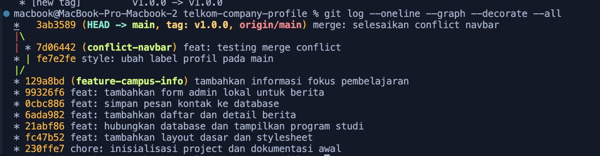

# Telkom University Company Profile - Praktikum

Proyek simulasi untuk mempelajari HTML, CSS, PHP native, MySQL/MariaDB, dan Git.

## Menjalankan secara lokal

1. Salin folder proyek ke `htdocs` XAMPP.
2. Start Apache dan MySQL.
3. Import `database/telkom_profile.sql` melalui phpMyAdmin.
4. Buka `http://localhost/telkom-company-profile-final/`.

> Catatan: seluruh konten institusi bersifat simulasi untuk pembelajaran.

## Riwayat Praktikum Git.

